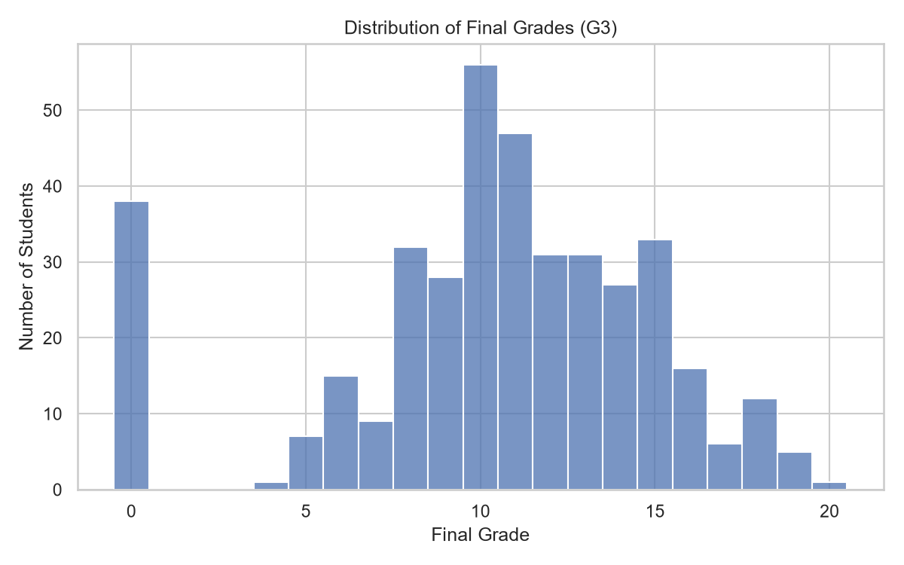
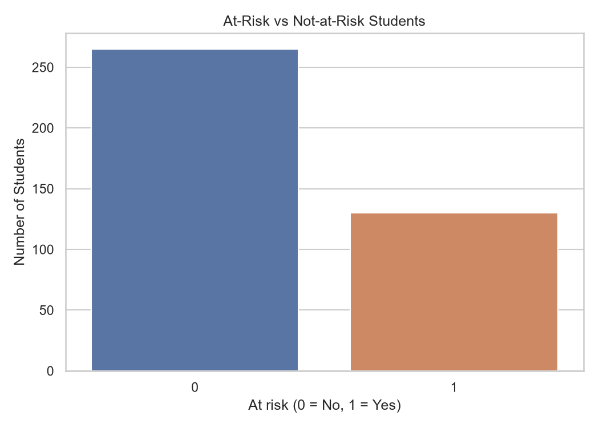
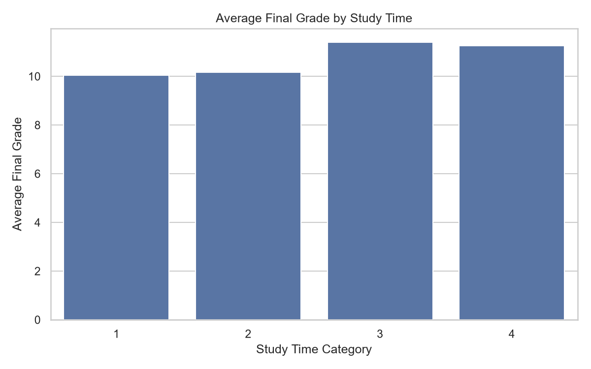

# Student Performance Analytics & At-Risk Prediction System

An end-to-end Machine Learning project that analyzes student performance and estimates whether a student may be at academic risk based on study habits, past failures, absences, and other student-related factors.

## Overview

The project combines Exploratory Data Analysis (EDA), Machine Learning, a REST API, and an interactive web dashboard to explore student performance patterns and provide risk predictions.

The system is designed as an educational prototype to support academic analysis. Predictions should not be used as the sole basis for decisions about students.

## Tech Stack

<p align="center">
  
  
  
  
  
  
  
  
</p>

## Key Features

- Exploratory Data Analysis of student performance data
- Analysis of grade distribution and study-time patterns
- Identification of students below a defined grade threshold
- Training and comparison of multiple Machine Learning models
- Cross-validation and evaluation using F1 score, accuracy, precision, recall, and ROC-AUC
- FastAPI backend for student risk predictions
- React dashboard for predictions and model analytics
- Automated backend tests using pytest

## Technology Stack

- **Language:** Python, JavaScript
- **Data Analysis:** Pandas, NumPy
- **Machine Learning:** Scikit-learn
- **Visualization:** Matplotlib, Seaborn, Recharts
- **Backend:** FastAPI, Uvicorn
- **Frontend:** React, Vite
- **Testing:** Pytest, FastAPI TestClient

## Dataset

The project uses the Student Performance dataset from the UCI Machine Learning Repository.

Dataset: https://archive.ics.uci.edu/dataset/320/student-performance

The current analysis uses `student-mat.csv`, which contains 395 student records.

The target variable is defined as:

- **At risk:** Final grade (G3) is below 10
- **Not at risk:** Final grade (G3) is 10 or above

In the current dataset, 130 students (32.91%) fall below this threshold. This is a dataset-level classification, not a judgment about a student's ability or future.

## Machine Learning Approach

Three models are trained and compared:

1. Dummy Classifier — baseline model
2. Logistic Regression
3. Random Forest Classifier

The training process excludes G1, G2, and G3 from the model input features to avoid using grade information that would leak the target.

The best model is selected using the mean F1 score from 5-fold cross-validation.

## Project Structure

```text
student-performance-analytics/
├── artifacts/              # Saved trained model
├── backend/
│   ├── app/
│   │   └── main.py          # FastAPI application
│   └── tests/
│       └── test_main.py     # Automated API tests
├── data/
│   └── student-mat.csv      # Dataset
├── frontend/
│   └── src/                 # React dashboard
├── ml/
│   └── src/
│       ├── inspect_data.py  # EDA and report generation
│       ├── train.py         # Model training
│       └── compare_models.py
├── reports/                 # EDA reports, charts, and metrics
├── requirements.txt
└── README.md
```

## Setup and Installation

### 1. Clone the repository

```bash
git clone <YOUR_GITHUB_REPOSITORY_URL>
cd student-performance-analytics
```

### 2. Create and activate a virtual environment

Windows PowerShell:

```powershell
python -m venv .venv
.\.venv\Scripts\Activate.ps1
```

### 3. Install Python dependencies

```powershell
pip install -r requirements.txt
```

### 4. Generate EDA reports

```powershell
python ml/src/inspect_data.py
```

This generates the EDA summary and charts inside the `reports/` directory.

### 5. Train the Machine Learning models

```powershell
python ml/src/train.py
```

This generates the trained model and model evaluation metrics.

### 6. Start the backend

Run this command from the project root:

```powershell
python -m uvicorn backend.app.main:app --reload
```

API documentation: http://127.0.0.1:8000/docs

### 7. Start the frontend

Open a second terminal:

```powershell
cd frontend
npm install
npm run dev
```

Open the local URL displayed by Vite, usually http://localhost:5173/.

### 8. Run automated tests

From the project root:

```powershell
python -m pytest backend/tests/test_main.py -v
```

## Exploratory Data Analysis

The EDA script generates:

- `grade_distribution.png` — distribution of final grades
- `risk_distribution.png` — at-risk versus not-at-risk students
- `studytime_vs_grade.png` — average grades by study-time category
- `eda_summary.txt` — dataset statistics and selected findings

Current dataset observations:

- Total students: 395
- Missing values: 0
- At-risk students: 130 (32.91%)
- Average final grade: approximately 10.42 out of 20

These are descriptive observations from this dataset and do not establish causal relationships.


### EDA Visualizations

**1. Distribution of Final Grades**



**2. At-Risk vs Not-at-Risk Students**



**3. Average Grade by Study Time**




## Model Evaluation

Model evaluation results are saved in `reports/metrics.json` and displayed in the Model Analytics section of the dashboard.

The project compares models using cross-validation F1 score and additional test-set metrics. Results may vary if the dataset, features, or training configuration changes.


## Model Performance

Three machine learning models were evaluated using 5-fold cross-validation and test-set metrics.

| Model | CV F1 Mean | CV F1 Std | Accuracy | Precision | Recall | Test F1 | ROC-AUC |
|---|---:|---:|---:|---:|---:|---:|---:|
| Dummy Classifier | 0.000 | 0.000 | 0.671 | 0.000 | 0.000 | 0.000 | 0.500 |
| Logistic Regression | 0.467 | 0.063 | 0.696 | 0.529 | 0.692 | 0.600 | 0.727 |
| Random Forest | 0.435 | 0.083 | 0.684 | 0.520 | 0.500 | 0.510 | 0.716 |

**Selected model:** Logistic Regression

**Selection criterion:** Highest mean F1 score across 5-fold cross-validation.

### Understanding the results

- **CV F1 Mean:** Average F1 score across the five validation folds.
- **Accuracy:** Proportion of all test examples classified correctly.
- **Precision:** Proportion of students flagged as at-risk who were actually at-risk.
- **Recall:** Proportion of at-risk students correctly identified by the model.
- **ROC-AUC:** Measures how well the model distinguishes between the two classes across classification thresholds.

Logistic Regression achieved a mean cross-validation F1 score of approximately 46.66% and a test-set F1 score of 60%.

These results are from a single train/test split and cross-validation on a relatively small dataset. They should be treated as preliminary educational results, not evidence of real-world deployment readiness.


## Limitations

- The dataset is relatively small and may not represent students from all educational settings.
- Predictions depend on the quality and representativeness of the training data.
- The selected grade threshold is a project-defined rule.
- Risk probabilities are model estimates and may not be well calibrated.
- The system is an educational prototype, not a validated decision-making tool.

## Future Improvements

- Add more datasets and evaluate generalization
- Improve explainability using feature importance or SHAP
- Add stronger input validation and error handling
- Deploy the application online
- Improve accessibility and dashboard design

## Author

Developed as a Machine Learning and full-stack portfolio project.
